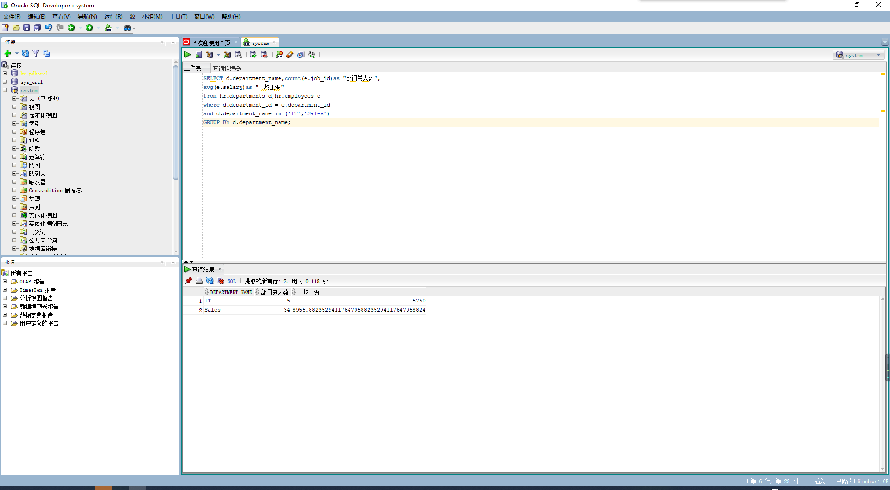

# test1

##### 姓名：覃龙

##### 学号：201810414121

##### 班级：2018级软件工程1班

##### 实验目的：分析SQL执行计划，执行SQL语句的优化指导。理解分析SQL语句的执行计划的重要作用。

##### 实验内容：对Oracle12c中的HR人力资源管理系统中的表进行查询与分析。

##### 首先运行和分析教材中的样例：本训练任务目的是查询两个部门('IT'和'Sales')的部门总人数和平均工资，以下两个查询的结果是一样的。但效率不相同。

##### 设计自己的查询语句，并作相应的分析，查询语句不能太简单。

- 查询1：

```sql
set autotrace on

SELECT d.department_name,count(e.job_id)as "部门总人数",
avg(e.salary)as "平均工资"
from hr.departments d,hr.employees e
where d.department_id = e.department_id
and d.department_name in ('IT','Sales')
GROUP BY d.department_name;
```

查询结果：



- `查询`2：

```sql
set autotrace on

SELECT d.department_name,count(e.job_id)as "部门总人数",
avg(e.salary)as "平均工资"
FROM hr.departments d,hr.employees e
WHERE d.department_id = e.department_id
GROUP BY d.department_name
HAVING d.department_name in ('IT','Sales');
```

查询结果：


通过分析得出查询2 是最优的 。

查询2的优化建议：


-  查询工资最高的3 名员工信息 ：

  ```sql
  SELECT * FROM 
  (SELECT d.department_name ,e.salary,e.first_name,e.last_name
  FROM hr.departments d,hr.employees e 
  WHERE d.department_id = e.department_id
  ORDER BY e.salary DESC) 
  WHERE ROWNUM <= 3;
  ```

  先查询出所有的信息通过工资排序，再筛选出前3名。


优化结果：

