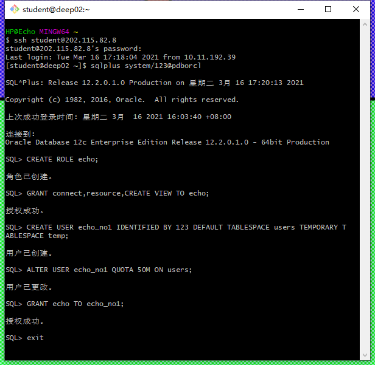
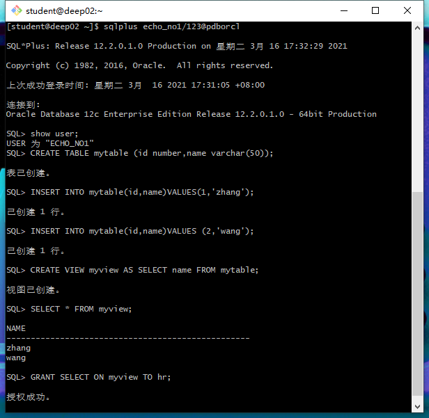
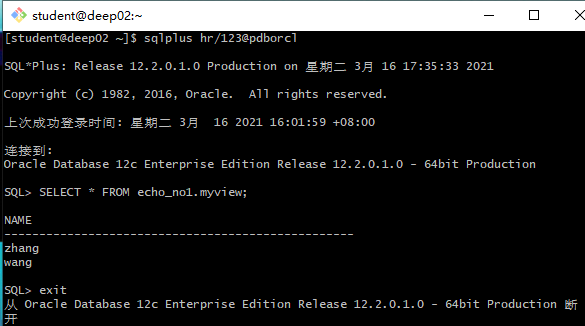

## test2

##### 姓名：覃龙

##### 学号：201810414121

##### 班级：2018级软件工程1班

##### 实验目的： 掌握用户管理、角色管理、权根维护与分配的能力，掌握用户之间共享对象的操作技能。 

##### 实验内容：对Oracle12c中的HR人力资源管理系统中的表进行查询与分析。

##### 首先运行和分析教材中的样例：Oracle有一个开发者角色resource，可以创建表、过程、触发器等对象，但是不能创建视图。本训练要求：

- 在pdborcl插接式数据中创建一个新的本地角色 con_res_view ，该角色包含connect和resource角色，同时也包含CREATE VIEW权限，这样任何拥有echo的用户就同时拥有这三种权限。

- 创建角色之后，再创建用户new_user，给用户分配表空间，设置限额为50M，授予echo角色。

- 最后测试：用新用户new_user连接数据库、创建表，插入数据，创建视图，查询表和视图的数据。

  

1. #####  以system登录到pdborcl，创建角色echo和用户echo_no1，并授权和分配空间： 

   ```sql
   $ sqlplus system/123@pdborcl
   SQL> CREATE ROLE echo;
   Role created.
   SQL> GRANT connect,resource,CREATE VIEW TO echo;
   Grant succeeded.
   SQL> CREATE USER echo_no1 IDENTIFIED BY 123 DEFAULT TABLESPACE users TEMPORARY TABLESPACE temp;
   User created.
   SQL> ALTER USER echo_no1 QUOTA 50M ON users;
   User altered.
   SQL> GRANT echo TO echo_no1;
   Grant succeeded.
   SQL> exit
   ```

   

2. #####  新用户echo_no1连接到pdborcl，创建表mytable和视图myview，插入数据，最后将myview的SELECT对象权限授予hr用户。 

   ```sql
   $ sqlplus echo_no1/123@pdborcl
   SQL> show user;
   USER is "echo_no1"
   SQL> CREATE TABLE mytable (id number,name varchar(50));
   Table created.
   SQL> INSERT INTO mytable(id,name)VALUES(1,'zhang');
   1 row created.
   SQL> INSERT INTO mytable(id,name)VALUES (2,'wang');
   1 row created.
   SQL> CREATE VIEW myview AS SELECT name FROM mytable;
   View created.
   SQL> SELECT * FROM myview;
   NAME
   --------------------------------------------------
   zhang
   wang
   SQL> GRANT SELECT ON myview TO hr;
   Grant succeeded.
   SQL>exit
   ```

   

   

3. #####  用户hr连接到pdborcl，查询echo_no1授予它的视图myview 

   ```sql
   $ sqlplus hr/123@pdborcl
   SQL> SELECT * FROM echo_no1.myview;
   NAME
   --------------------------------------------------
   zhang
   wang
   SQL> exit
   ```

   

   

4. #####  测试一下同学用户之间的表的共享，只读共享和读写共享都测试一下。 

