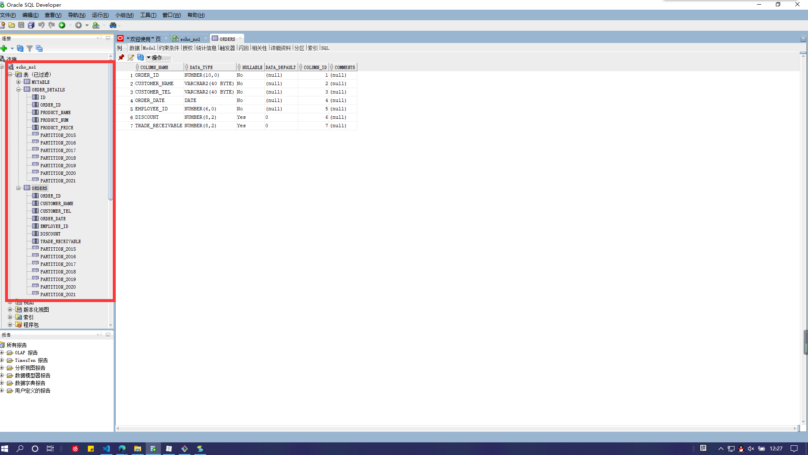
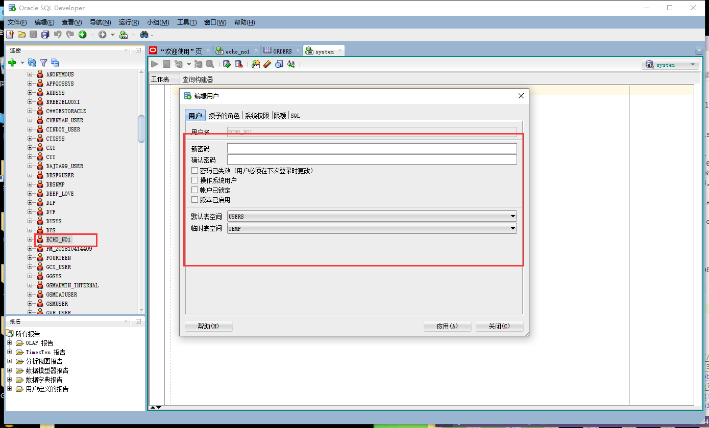
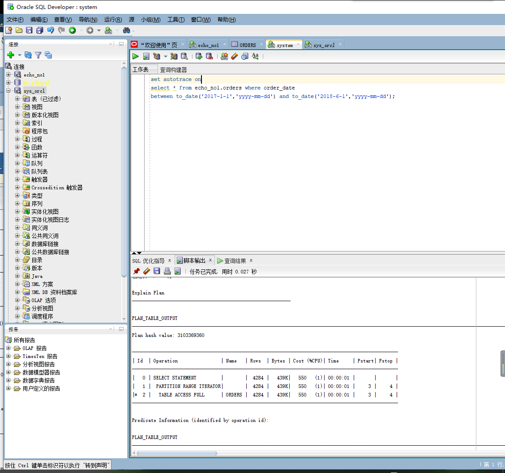
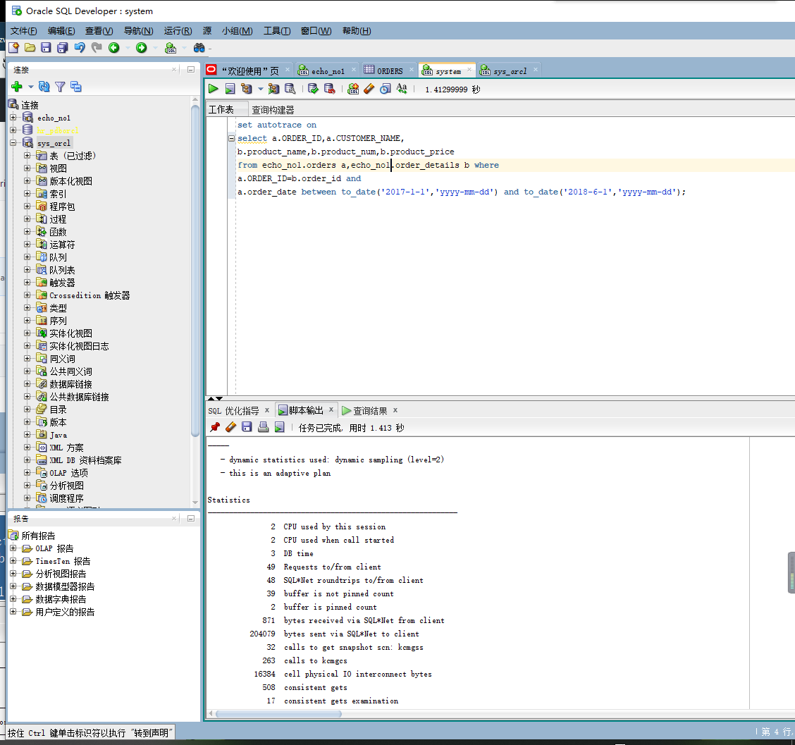
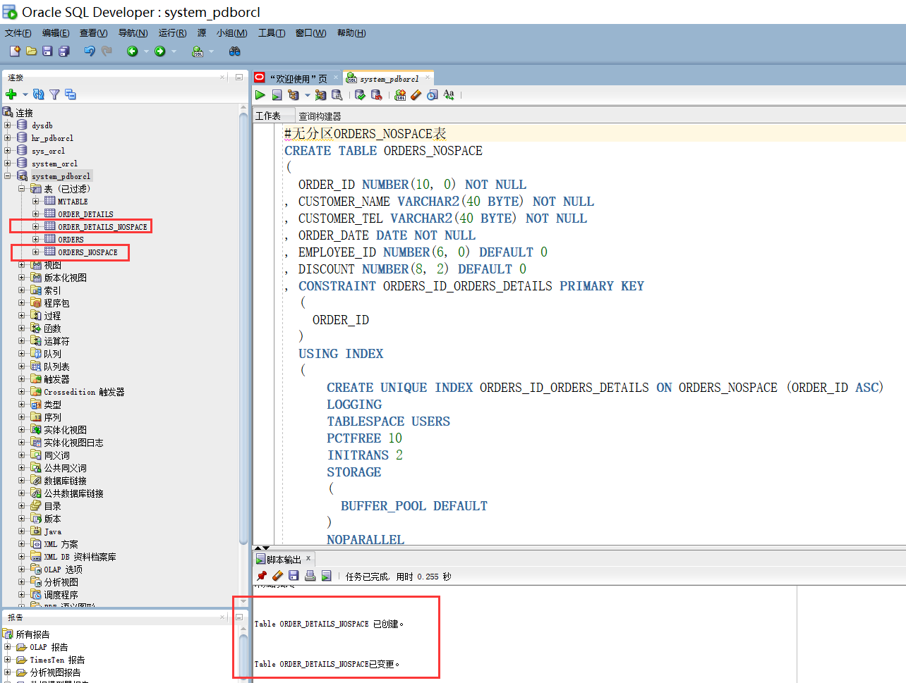
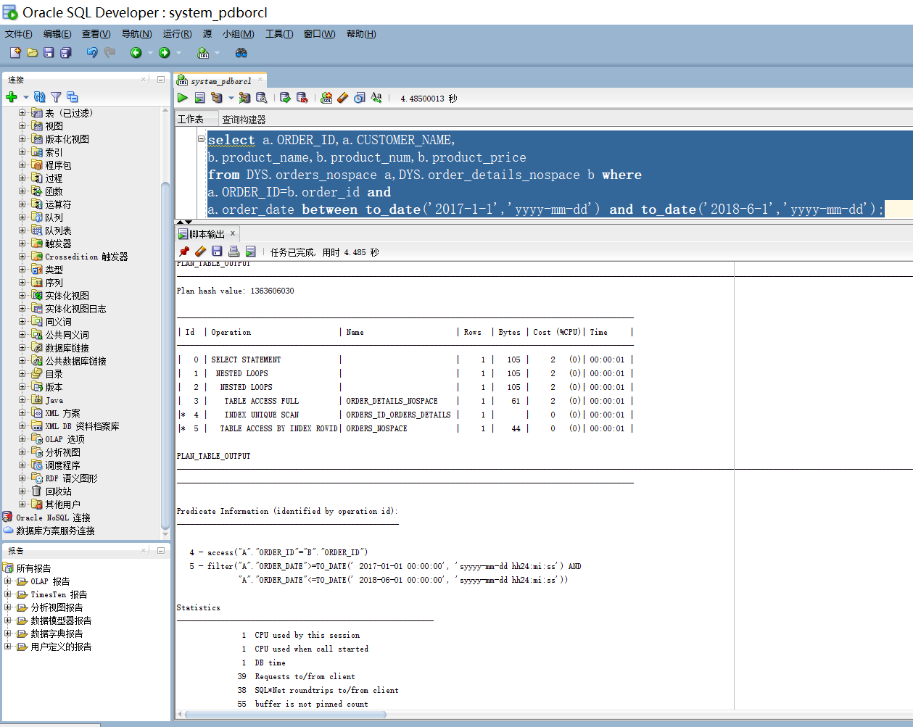

# test3：创建分区表

##### 姓名：覃龙

##### 学号：201810414121

##### 班级：2018级软件工程1班

## 实验目的

#####  掌握分区表的创建方法，掌握各种分区方式的使用场景。 

## 实验内容

- ##### 本实验使用3个表空间：USERS,USERS02,USERS03。在表空间中创建两张表：订单表(orders)与订单详表(order_details)。

- ##### 使用你自己的账号创建本实验的表，表创建在上述3个分区，自定义分区策略。你需要使用system用户给你自己的账号分配上述分区的使用权限。

- ##### 你需要使用system用户给你的用户分配可以查询执行计划的权限。

- ##### 表创建成功后，插入数据，数据能并平均分布到各个分区。每个表的数据都应该大于1万行，对表进行联合查询。写出插入数据的语句和查询数据的语句，并分析语句的执行计划。

- ##### 进行分区与不分区的对比实验。

  ## 实验步骤

1. #####   在主表orders和从表order_details之间建立引用分区 在study用户中创建两个表：orders（订单表）和order_details（订单详表），两个表通过列order_id建立主外键关联。orders表按范围分区进行存储，order_details使用引用分区进行存储。 创建orders表的部分语句是： 

   在用户echo_no1中创建表：orders（订单表）
   
  ```sql
   SQL>CREATE TABLESPACE users02 DATAFILE
   '/home/student/你的目录/pdbtest_users02_1.dbf'
     SIZE 100M AUTOEXTEND ON NEXT 50M MAXSIZE UNLIMITED，
   '/home/student/你的目录/pdbtest_users02_2.dbf' 
     SIZE 100M AUTOEXTEND ON NEXT 50M MAXSIZE UNLIMITED
   EXTENT MANAGEMENT LOCAL SEGMENT SPACE MANAGEMENT AUTO;
   
   SQL>CREATE TABLESPACE users03 DATAFILE
   '/home/student/你的目录/pdbtest_users02_1.dbf'
     SIZE 100M AUTOEXTEND ON NEXT 50M MAXSIZE UNLIMITED，
   '/home/student/你的目录/pdbtest_users02_2.dbf' 
     SIZE 100M AUTOEXTEND ON NEXT 50M MAXSIZE UNLIMITED
   EXTENT MANAGEMENT LOCAL SEGMENT SPACE MANAGEMENT AUTO;
   
   SQL> 
   
   CREATE TABLE orders 
   (
    order_id NUMBER(10, 0) NOT NULL 
    , customer_name VARCHAR2(40 BYTE) NOT NULL 
    , customer_tel VARCHAR2(40 BYTE) NOT NULL 
    , order_date DATE NOT NULL 
    , employee_id NUMBER(6, 0) NOT NULL 
    , discount NUMBER(8, 2) DEFAULT 0 
    , trade_receivable NUMBER(8, 2) DEFAULT 0 
    , CONSTRAINT ORDERS_PK PRIMARY KEY 
     (
       ORDER_ID 
     )
   ) 
   TABLESPACE USERS 
   PCTFREE 10 INITRANS 1 
   STORAGE (   BUFFER_POOL DEFAULT ) 
   NOCOMPRESS NOPARALLEL 
   
   PARTITION BY RANGE (order_date) 
   (
    PARTITION PARTITION_BEFORE_2016 VALUES LESS THAN (
 TO_DATE(' 2016-01-01 00:00:00', 'SYYYY-MM-DD HH24:MI:SS', 
    'NLS_CALENDAR=GREGORIAN')) 
 NOLOGGING
    TABLESPACE USERS
    PCTFREE 10 
    INITRANS 1 
    STORAGE 
   ( 
    INITIAL 8388608 
    NEXT 1048576 
    MINEXTENTS 1 
    MAXEXTENTS UNLIMITED 
    BUFFER_POOL DEFAULT 
   ) 
   NOCOMPRESS NO INMEMORY  
   , PARTITION PARTITION_BEFORE_2020 VALUES LESS THAN (
   TO_DATE(' 2020-01-01 00:00:00', 'SYYYY-MM-DD HH24:MI:SS', 
   'NLS_CALENDAR=GREGORIAN')) 
   NOLOGGING 
   TABLESPACE USERS
   , PARTITION PARTITION_BEFORE_2021 VALUES LESS THAN (
   TO_DATE(' 2021-01-01 00:00:00', 'SYYYY-MM-DD HH24:MI:SS', 
   'NLS_CALENDAR=GREGORIAN')) 
   NOLOGGING 
   TABLESPACE USERS02
   );
   --以后再逐年增加新年份的分区
   ALTER TABLE orders ADD PARTITION partition_before_2022
   VALUES LESS THAN(TO_DATE('2022-01-01','YYYY-MM-DD'))
   TABLESPACE USERS03;
  ```

   

   ###### 创建order_details表的部分语句如下：

   ```sql
CREATE TABLE order_details
   (
id NUMBER(10, 0) NOT NULL
   , order_id NUMBER(10, 0) NOT NULL
, product_name VARCHAR2(40 BYTE) NOT NULL
   , product_num NUMBER(8, 2) NOT NULL
, product_price NUMBER(8, 2) NOT NULL
   , CONSTRAINT order_details_fk1 FOREIGN KEY  (order_id)
   REFERENCES orders  (  order_id   )
   ENABLE
   )
   TABLESPACE USERS
   PCTFREE 10 INITRANS 1
   STORAGE (BUFFER_POOL DEFAULT )
   NOCOMPRESS NOPARALLEL
   PARTITION BY REFERENCE (order_details_fk1);
   ```

   

   #### 建表完成后



   #### 以system用户修改echo_no1用户的权限

 

   ##### 执行计划分析：





   #### 以用户sys创建无分区表

   ```sql
   CREATE TABLE ORDERS_NOSPACE 
   (
     ORDER_ID NUMBER(10, 0) NOT NULL 
   , CUSTOMER_NAME VARCHAR2(40 BYTE) NOT NULL 
   , CUSTOMER_TEL VARCHAR2(40 BYTE) NOT NULL 
   , ORDER_DATE DATE NOT NULL 
   , EMPLOYEE_ID NUMBER(6, 0) DEFAULT 0 
   , DISCOUNT NUMBER(8, 2) DEFAULT 0 
   , CONSTRAINT ORDERS_ID_ORDERS_DETAILS PRIMARY KEY 
     (
       ORDER_ID 
     )
     USING INDEX 
     (
         CREATE UNIQUE INDEX ORDERS_ID_ORDERS_DETAILS ON     ORDERS_NOSPACE (ORDER_ID ASC) 
         LOGGING 
         TABLESPACE USERS 
         PCTFREE 10 
         INITRANS 2 
         STORAGE 
         ( 
           BUFFER_POOL DEFAULT 
         ) 
         NOPARALLEL 
     )
     ENABLE 
   ) 
   LOGGING 
   TABLESPACE USERS 
   PCTFREE 10 
   INITRANS 1 
   STORAGE 
   ( 
     BUFFER_POOL DEFAULT 
   ) 
   NOCOMPRESS 
   NO INMEMORY 
   NOPARALLEL;
   
   #建立orders_details_nospace表
   CREATE TABLE ORDER_DETAILS_NOSPACE 
   (
     ID NUMBER(10, 0) NOT NULL 
   , ORDER_ID NUMBER(10, 0) NOT NULL 
   , PRODUCT_NAME VARCHAR2(40 BYTE) NOT NULL 
   , PRODUCT_NUM NUMBER(8, 2) NOT NULL 
   , PRODUCT_PRICE NUMBER(8, 2) NOT NULL 
   ) 
   LOGGING 
   TABLESPACE USERS 
   PCTFREE 10 
   INITRANS 1 
   STORAGE 
   ( 
     INITIAL 65536 
     NEXT 1048576 
     MINEXTENTS 1 
     MAXEXTENTS UNLIMITED 
     BUFFER_POOL DEFAULT 
   ) 
   NOCOMPRESS 
   NO INMEMORY 
   NOPARALLEL;
   
   ALTER TABLE ORDER_DETAILS_NOSPACE
   ADD CONSTRAINT ORDERS_FOREIGN_ORDERS_DETAILS FOREIGN KEY
   (
     ORDER_ID 
   )
   REFERENCES ORDERS_NOSPACE
   (
     ORDER_ID 
   )
   ENABLE;
   ```



   #### 对无分区表执行计划分析



   #### 实验总结

   ##### 结论：在分区表里查询数据，同一个分区查找明显比不同分区查找快、有分区比无分区查找数据优势更大，且分区表在数据量大时进行查找的优势比较大，数据小时有无分区的差别不大。

